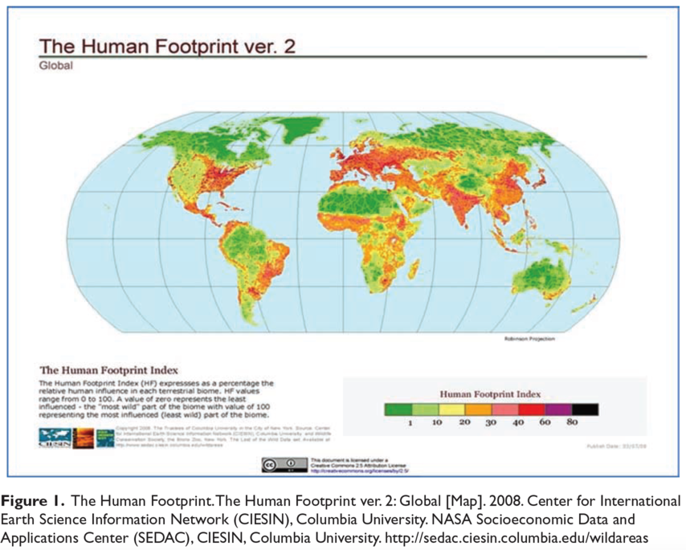
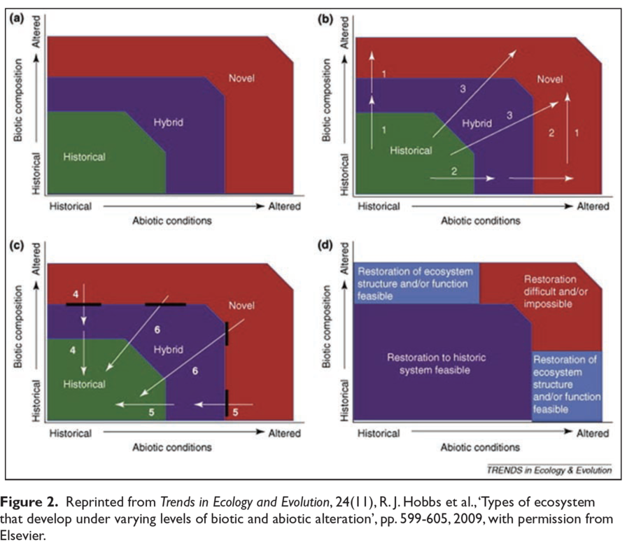

**Abstract 摘要**

> The quickly changing character of the global environment has predicated
a number of crises in the sciences of biology and ecology. Specifically, the
rapid rate of ecological change has led to the proliferation of novel
ecologies. These unprecedented ecosystems and assemblages challenge the
scientific, as well as cultural, core of many disciplines. This has led to
divisive debates over what constitutes a ‘natural’ system state, and over what
kinds of interventions, if any, should be advocated by scientists. In this
paper, we review the nature of the recent discomfort, conflict, and ambivalence
experienced in some sciences. In examining these, we stress emerging and
conjoined concerns in ecological scientific communities. Specifically, we
identify, on the one hand, an expressed concern that practitioners have been
insufficiently persistent and explicit in proselytizing the current risks of
human impacts, and on the other hand an obverse concern that many historically
common scientific concepts and concerns (like ‘invasive’ species) are already
overly normative and culturally freighted. We identify the resulting
contradictory condition as ‘ecological anxiety disorder’, announced either as
a fearful response to: 1) the negative normative influence of humans on the
earth (anthrophobia) or 2) the inherent influence of normative human values
within one’s own science (autophobia). We then argue, drawing on the
psychoanalytic work of Jacques Lacan, that these paralyzing phobias are born of
an inability to address more fundamental anxieties. Only by explicitly
enunciating the object of scientific desire, we argue, as Lacan suggests, can
scientific practitioners come to terms with these anxieties in a way that does
not lead to dysfunction. Using a case example of island rewilding in the Indian
Ocean, we provide an alternative mode of resolving and adjudicating human
influences and normative aspects in ecology and biology, one that is explicitly
political.

> 全球環境的快速變化造成了諸多生物學和生態學中的危機。特別的，生態的急
速變化導致了新興生態的擴增。這些前所未有的生態系統及其組合在科學和文
化上挑戰了眾多學科。該情況帶來了激烈的爭論：什麼才是「自然」的系統狀態
，以及，如果有的話，科學家可以建議怎樣的干預。本文中，我們回顧了近年來
幾門科學中的不適、衝突和矛盾的特質。通過審視這些特質，我們突出強調在生態
科學團體中新出現與復合的憂慮。特別地，我們一方面指出對於從業人員的宣講
不夠貫徹和明確業已表達的擔憂，另一方面也指出很多歷史上通常的科學概念已經
被過度規範化以致於成為文化負擔。我們把因此產生的衝突的狀況稱為「生態焦慮
症」，用以表示對於1）人類之於地球的負面規範化的影響；或是2）本學科內固
有的人的規範化價值的畏懼反應。接下來，我們根據雅各·拉岡的精神分析的理
論，說明這些致瘓的恐懼症皆生自無法解決更基本焦慮的無能。如拉岡所講，
我們認為，只有通過明確地表達科學慾望的目標，科學從業者方可克服此種焦慮而
不致功能障礙。利用印度洋島嶼野化一例，我們提供了另一種方式，一種明確的政治
性的，在生態與生物學中解釋及判定人類影響和規範的方式。

**Keywords 關鍵字**

_Edenic Sciences, invasive species, Jacques Lacan, novel ecologies, political
ecology, psychoanalytic geography, rewilding, scientific culture_

*伊甸園科學，入侵物種，雅各·拉岡，新生態圈，政治生態學，精神分析地理學，野化，科學文化*

In June of 2011, 18 scientists published a commentary in Nature entitled ‘Don’t
Judge Species by their Origins’ in which they argued that threats posed by
alien or exotic species are grossly overstated. More radically, the essay
suggested that the field of ‘invasion biology’ stands on shaky ground, and that
its underlying assumption that a ‘native’ condition can and should be known or
restored – was flawed.1 Following a previous line of argument by the
commentary’s lead author Mark Davis,2 the essay stressed moreover that given
its normative underpinnings, invasion biology might be abandoned altogether as
a unique science and subsumed under the broader field of community ecology.
Rather than analyzing and extirpating species, the authors insisted, we might
learn to accept and live with some ‘novel ecologies.’

2011年六月，十八位科學家在《自然》雜誌上發表了題為「不要以起源來品評物
種」的評論，認為外來物種的威脅被大大地高估了。更激進的是，該文還表示「
入侵生物學」這門學科建立在不穩固的基礎上，並且它所依據的，認為一種「原始
」的狀態可能且應該被了解和恢復的假設是有瑕疵的[^1]。順著該文主要作者馬克·戴
維斯之前的評論[^2]，文中又著重強調因為入侵生物學規範性的基礎，它一門獨立科學
的地位應該被通通拋棄而併入更廣泛的群落生態學。作者堅持說，與其分析和撲殺
物種，我們不如學會如何接受且和一些「新生態圈」共處。

This largely innocuous claim, made in the context of a relatively obscure
debate in a specialized field, set a spark and elicited quick responses. In
July 2011, a half dozen defiant commentaries and letters appeared in both the
journals Nature and Science, signed by hundreds of biologists, ecologists,
conservationists, and resource managers, who argued vociferously against Davis
and his colleagues.3 Meetings were convened, scientists argued, and calls to
battle were raised.

這份在相對模糊的辯論中關於一專門學科所下的無害的論斷，擦出一點火花，並點燃
了迅速的反響。同年七月，六篇公然挑釁的評論和通訊紛紛發表在《自然》和《科
學》雜誌上，由數百位生物學家，生態學家，保守主義者，資源管理人員聯署，歇
斯底里地抨擊戴維斯及他的同事[^3]。一時間，會議接連召開，科學家們爭辯不休，
以至摩拳擦掌、向對方宣戰。

There is much to say about this debate and the scientific merits of the various
positions, but for our purposes, these are largely beside the point. It is
instead the fervency of the debate which raises questions about the status of
scientific communities and current trends in the sources and terms of their
controversies. Davis had clearly hit a nerve – what invasion biologist Julie
Lockwood has called ‘the third rail of invasion biology.’4

這場爭論以及其中多方立場的科學價值盡可詳述，但這對本文來說卻不免離題。倒
是爭論之激烈引出了對於科學圈以及當下圈內的爭議的源頭及用語的趨勢之疑問。
戴維斯自然是觸動了一個敏感點，正如入侵生物學家茱莉·洛庫德所稱「入侵生物
學的第三軌」[^4]。

What makes a topic like this one the ‘third rail,’ a topic that dare not be
broached? In part, it is that the specific topic of alien species carries
complex interpretive baggage, lending the debate added cultural freight, as
noted extensively elsewhere.5 As we will argue here, however, this single
debate is indicative of a larger upheaval throughout what could best be
described as the ‘Edenic Sciences’ – understood to include, among others,
conservation biology, restoration ecology, and invasion biology. These
sciences, though rigorous and significant in every regard, share a tacit
epistemological commitment to evaluating ecological relationships explicitly
with regard to an a priori baseline – a condition before the Columbian
encounter, or a time or place before human contact, or a place of expulsion or
return – one Before the Fall. As such, Davis’ call for the acceptance of ‘novel
ecologies’ represents an existential crisis for practitioners of what might
best be termed, Edenic Sciences. Whether or not invasion science is merely an
effort at restorative nostalgia and not a unique science at all, in other
words, has stakes for whole ways of doing science.

是什麼使像這樣的一個話題成為「第三軌」而沒人敢碰的呢？一方面，這是由於
關於外來物種的議題承載著複雜的解釋負擔，如在別處詳述過的[^5]，這也給予此場爭
論額外的文化承載。然而，我們這裡要討論的，是這場爭論實則意味著一場遍及所
謂「伊甸園科學」的更大的動盪，其中包括保守生物學，修復生態學，入侵生物學
，等等。這些科學，雖然各方面來講都嚴格且有意義，卻暗藏著認知論約定，來明
確地依照先驗的基準——譬如說哥倫布發現美洲之前，或是人類尚未踏足之前
的時間地點，或是一個可放逐回歸，一個「秋日之前」的地方——來明確地評
價生態關係。因此，戴維斯所呼籲的對「新生態圈」的接受代表著那些可稱為是伊
甸園科學的研究人員的存在主義危機。入侵科學到底是否完全不是一個獨立的學科
，而僅僅是一場復原性的懷舊病，換言之，完全取決於做科學的方式。

In this paper, we will review the nature of recent anxiety, discomfort,
conflict, and ambivalence experienced by research scientists in fields
confronting ecological novelty in a quickly-changing world. In examining the
anxieties of doing science, we stress emerging and conjoined concerns in
ecological scientific communities. Specifically, we identify, on the one hand,
an expressed concern in the scientific community that practitioners have been
insufficiently persistent and explicit in proselytizing the current risks of
human impacts, and on the other hand to the obverse concern that many
historically common scientific concepts and concerns (like ‘invasive’ species)
are already overly normative and culturally freighted.

本文中，我們將回顧近期在快速變化的世界中面對新興生態的科學家們所經歷的
焦慮，不適，衝突和矛盾的性質。通過檢視從事科學中的焦慮，我們強調生態學社
群中新發生的以及組合的憂慮。特別地，我們一方面指出科學圈中的從業人員在傳
播當前人類影響時的不充分和不明確，另一方面，我們也觀察到一切由來已久的一
切通常的科學概念和顧慮（比如「入侵」物種）已經過度地被規範化以致具有了文
化承載。

We identify the resulting condition as ecological anxiety disorder (EAD),
announced either as a fearful response to: 1) the negative normative influence
of humans on the earth (anthrophobia) or 2) the inherent influence of normative
human values within one’s own science (autophobia). We then argue, drawing on
the psychoanalytic work of Jacques Lacan, that these paralyzing phobias are
born of an inability to address more fundamental anxieties. Only by explicitly
enunciating the object of scientific desire, as Lacan suggests, can
practitioners come to terms with these anxieties in a way that does not lead to
dysfunction.

我們把這招致的症狀稱作為生態焦慮失調（ecological anxiety disorder; EAD
），其症狀是對1）人類對地球的負面的規範影響（恐人症），或是對2）本學科內
的規範化人類價值所固有的影響（自恐症）之恐懼。通過引用雅各·拉岡心理分析
學的工作，我們接下來會論證這些致瘓的恐懼症產生自一種對更根本的焦慮控制的
無能。只有明確地指出科學慾望的目的，正如拉岡所建議的，科學從事者才可以和
這些焦慮共處而不致功能障礙。

After briefly reviewing the case of experimental rewilding in the southern
Indian Ocean, we provide an alternative mode of resolving and adjudicating
human influences and normative aspects of science, one that is explicitly
political. The approach we suggest, following Emma Marris and Bruno Latour, is
one that embraces the monsters created in a world where humans exert strong
influence. But it also must be an approach that enunciates its commitments and
desires in political struggles and therefore productively mobilizes alliances
between various at-risk polities and scientific researchers.

在簡要地回顧南印度洋試驗性野化島嶼的案例後，我們會提供解決和裁定人類影
響以及科學的規範化面向的另一種模式，一種明確地政治的模式。我們所建議的方
案，如艾瑪·瑪莉絲和布魯諾·拉托所言，是一種在人類業已造成巨大影響的世界
中去擁抱這些怪獸的方案。但同時，它必須也是以個清楚說出其在政治掙扎中但承
諾及願望的方案，所以它才能積極地調動各式各樣瀕危的政體與科學研究人員之間
的聯盟。

### Cultural artifacts of the Anthropocene 人類世的文物

The debates in the pages of Nature and Science are ones that express the
emerging cultural components of the Anthropocene. In ‘Anthropocene,’ we here
adopt the metaphoric term assigned most famously to the current geological
epoch (vis-a-vis previous periods, e.g. the Pliocene or Miocene epochs,
millions of years ago) by Chemist Paul Joseph Crutzen6 to indicate a period in
which human activities have come to have significant global impact. These
activities include the full range of human activities on the earth, including
deforestation, greenhouse gas emissions, and so on, which Crutzen suggests came
to predominate in the industrial era, a period starting roughly 225 years ago,
when James Watt designed the steam engine in 1784.

在《自然》和《科學》中的辯論體現了人類世湧現出來的文化成分。在「人類世
」一詞中，我們採用化學家保羅·約瑟夫·克盧岑所提出的最著名的對當今地質時
期的修辭[^6]，來表示這一人類活動已具有全球化影響的時期。這些活動囊括了人類在
地球上的全部活動：森林砍伐、溫室氣體排放等等，克盧岑認為這些活動在工業時
代——始於大約225年前的1784年，當詹姆士·瓦特設計蒸汽機時——達到主導的
地位。

The struggle over invasives is rooted in a relatively young science, one born
in precisely this current Anthropocene era. Invasion biology and ecology
developed from the critically important work of ecologist Charles Elton in the
1950s,7 but exploded into a field of its own in the 1990s. These fields are
linked closely both to the heavily-human-influenced landscapes of the period
since 1492, but also to the very recent efforts in ‘restoration ecology’ to
reclaim and remediate environments that have been heavily degraded.8 The core
of this science is, therefore, one predicated on recovering environmental
conditions that are directly or indirectly anthropogenic.

對抗入侵的鬥爭源於一門相對年輕的科學，一門正是誕生在當前這個人類世的科
學。入侵生物學和入侵生態學由1950年代生態學家查爾斯·艾爾頓的關鍵工作發展
而來[^7]，但在1990年代才迅速發展成為一門獨立的學科。這些領域同1492年以來深受
人類活動影響的山水緊密連結，但同時也和近年來收回與修復業已被嚴重破壞的環
境的「復原生態學」息息相關[^8]。因此，這門科學的核心旨在修復直接或間接的屬於
人類世的環境狀況。

Davis’s article went to the normative heart of several cherished concepts in
this young field by empirically questioning claims like the widely-cited (but
poorly demonstrated) one that invaders are the second-greatest threat to the
survival of threatened species worldwide.  Davis and his coauthors point out
that many species that people take to be native are indeed aliens and that many
invaders have positive or neutral impacts. But they also argue something
further, offering a tacit critique of the foundational concepts of ecological
restoration – starting points and hopes of environmental return:

通過質疑被廣為引用（卻疏於論證）的認為入侵種是對世界範圍內物種生存的第
二大威脅的觀點，戴維斯的文章直指這門年輕的科學所推崇觀念之規範化核心[^9]。戴
維斯與合著者指出很多人們認為是本土的物種其實是外來的，並且很多入侵種具有
中性甚至有益的影響。但他們還道出了更多，隱晦地批評了關於生態重建的最基本
的概念——其出發點以及對環境回歸的希望：

> Most human and natural communities now consist both of long-term residents
and of new arrivals, and ecosystems are emerging that have never existed
before. It is impractical to try to restore ecosystems to some ‘rightful’
historical state... We must embrace the fact of ‘novel ecosystems’ and
incorporate many alien species into management plans, rather than try to
achieve the often impossible goal of eradicating them...

> 現在絕大多數人類和自然的社群都既包含長期的居民也有新來的族群，並且有
之前從未存在過的生態系統在形成。試圖將生態系統恢復到某種「正確」的歷史狀
態是不現實的⋯⋯我們必須接受「新興生態」的事實，並把諸多外來種納入我們管理
的計畫，而不是試圖達到往往達不到的移除它們的目標⋯⋯[^10]

The message that must be taken to the public is therefore that there is nothing
special about novel ecologies, and if there ever was a ‘rightful’ natural
condition to which to return, it is inaccessible to us in a world of global
environmental change. Writing for the objectors, ecologist Daniel Simberloff
stressed that restorationists and conservationists do not oppose aliens, per
se, only ‘invaders.’ On the other hand, Simberloff argues that aliens are
indeed often terrifically pernicious and should always be watched, that their
eradication is possible, and that the ‘public must be vigilant of introductions
and continue to support the many successful management efforts.’11 Elsewhere,
Lambertini and others argued similarly against Davis and his colleagues by
insisting that ‘as leaders of conservation organizations with missions to
protect biodiversity, we believe that the endorsement of invading species
– although potentially stimulating from an academic perspective – risks
trivializing the global action that is needed to address one of the most severe
and fastest growing threats to biological diversity.’ In other words, even if
Davis might technically be correct, it is dangerous to carry on this discussion
in public. Clearly then, from whichever side of the debate, the struggle at the
heart of this argument is one that can only exist in a contemporary context
where the influence of humanity as a significant or dominant actor in earth
systems is widely accepted by all.

因此，我們必須告知公眾的，是新興生態並無特殊之處，且即使真有所謂「正確
」的自然狀況讓我們去回歸，它也因在這樣一個全球環境劇變的世界而無法企及。
生態學家丹尼爾·新波羅夫為反對者寫道，修復主義者和保守主義者並不反對外來
種本身，而是反對「入侵種」。另一方面，新波羅夫也指出外來種往往也是非常地
有毒害作用，需要被密切留意，且其清除是可行的，所以「公眾必須警惕它們的引
入，並繼續支持成功對外來種管控的努力。」[^11]另一批評中，藍波狄尼和合著者也提
出類似的對戴維斯和他的同事的反對意見[^12]。他們堅持道「正如保守團體的領導者有
保護生態多樣性的任務，我們相信這樣為入侵種背書——即使可能僅是從學術視角
來促進——貶低了這些亟需的、為治理最嚴重、增長最快的對生物多樣性的危害之
全球行動的重要性。」換言之，即使戴維斯事實上是正確的，繼續在公共場合討論
此話題也是危險的。至此已經十分顯然地是，不論是哪一方，這場辯論的核心衝突
只可能在當今的背景下才會存在，因為人類的影響作為一個在地球系統中顯著或是
主導的因素已經被廣為接受。

This colorful contest, replete with competing metaphors, is only one of
a handful of creative expressions increasingly typical in scientific accounts
and debates over ecological process. Such texts, visualizations, and schematics
have proliferated in recent years, making them an archive of material culture
of the Anthropocene, inflected with particular valences and habits of
representation.

這場多彩的競賽，充滿著競爭的隱喻，僅僅是在生態過程的科學描述和爭論中日
益成為典型的一些有創意的表達之一。這樣的文字，可視化，和概述在近年來層出
不窮，使之成為人類世的物質文化檔案，為特殊價鍵與慣態的呈現所改變形態。

Consider ‘The Human Footprint Analysis’ shown in Figure 1, which indicates that
a large proportions of the global land surface is significantly impacted by
human activities; indeed, the analysis suggests that 83 percent of the land
surface of the earth is affected (afflicted) to some degree. A product of the
Wildlife Conservation Society (WCS) and the Center for International Earth
Science Information Network (CIESIN) at Columbia University, the work is really
a product of overlay, piling human population distribution, urban areas, roads,
navigable rivers, and various agricultural lands into an indexed range of
anthropogenic influence. Effectively, it maps human impact by mapping human
presence.

讓我們來看圖一中的「人類足跡分析」，它表明全球絕大多數陸地已經被人類活
動顯著地影響了；確實，這個分析指出83%的地球陸地面積已經被影響（破壞）到
一定程度。作為野生生物保護學會（WCS）以及位於哥倫比亞大學的國際地球科學
信息網絡中心（CIESIN）的作品，此圖實際上是把人口分佈，城市區域，道路，通
航的河流，以及各種農用土地一起堆疊稱一個人類世影響指數。可以說，它通過繪
製人類的存在來畫出人類的影響。

Future archaeologists may wonder why cartographers of our period chose not to
portray images of the extent of the earth’s surface that have been impacted by
other species or beings, making maps to determine how much of the earth had
been impacted by microbes, for example. They would nevertheless have to
conclude that the rust-colored blight on the face of the map was meant to
signal acute concern of terrestrial decay, a state of fallen grace, and doubt
about the possibility of return.

未來的考古學家可能會納悶為什麼我們時代的地圖繪製者沒有選擇去畫地球表面
被別的生物所影響的程度，比如畫一幅決定地球有多大面積被微生物影響。不論如
何他們也會做結論道，這幅地圖表面那鐵鏽般顏色標誌這陸地退化的嚴峻形勢，一
種優雅墮落的狀態，並且質疑其恢復的可能。

More ambivalent expressions also abound. The popular journalistic account, The
World without Us, which has been called a ‘Left Behind for seculars,’13 posits
what the earth might look like should humans suddenly disappear from its face.
Alan Weisman’s book is compelling, beautifully articulated, and fascinating, to
be sure. It is also as much about the built environment as it is about the
natural one, since much of its most interesting text concerns the remarkably
fast rate at which human infrastructure might be metabolized by natural forces,
plants, decay, and growth. The book is compelling enough to have inspired
a range of nature-television versions, and parallels a serious scientific
examination of the Chernobyl region of the Ukraine, an area that has indeed
been reclaimed by non-humans since the time of the nuclear disaster there.

比這些更矛盾的表述也數不勝數。被譽為「世俗者的末日謎從」的暢銷報告文學
《沒有我們的世界》，描述了如果人類突然從地球上消失後地球的樣子[^13]。確實，艾
倫·韋斯曼的這本書論述充分，語言優美清晰且引人入勝。它同時既是書寫人為的
，也是關於自然的環境的，因為其中最有趣的段落正是描述了人類的基礎建設會以
可觀的速度為自然力：植物、腐蝕、和生長所新陳代謝。這本書足夠令人信服，以
至於賦予了一系列自然電視節目以靈感，同時也激發了對烏克蘭車諾比地區認真的
科學考察；核災之後，那裏的確已經被非人類生物佔據。

At bottom, however, the book taps into something more subtle but prevalent in
the imagination of environmental scholars. Reviews of the book by figures like
Bill Mckibbon and others chose to accept the fanciful premise as a kind of
environmental parable, an end-times call to save the earth from humanity. The
profound assumption of human exceptionalism is notable here. Indeed, a far more
wild and dramatic earth-transformative premise might have been what the world
would look like if fungus suddenly ceased to exist. The choice to depict one
rather than the other marks the work as Anthropocene literature in the most
formal sense. But it also stands on the horns of a contradiction: how fully
transformed the world is by our presence and how indifferently the planet would
recover from our absence. Are we too powerful a species, the Anthropocene
author anxiously asks, or rather, irrelevant?

然而，追根究底，這本書涉及到了一些更微妙，但卻在環境科學學者想像中十分
普遍的東西。像比爾·麥基邦和其他一些此書的評論者選擇接受書中天馬行空的描
述作為一種環境寓言，一種拯救地球於人類的末世疾呼。這裏值得注意的是其中深
深的人類個別論之假設。沒錯，如果真菌突然消失，地球可能會經歷一番更加劇烈
的變化。該書選擇描述人類而不是其他生物極其正式的意義上說明了它是一部人類
世的文學作品。不過它也揭示了矛盾的兩端：我們的存在如何完全改變了世界的樣
子，以及這顆星球如何毫不在乎地因我們消失而恢復原樣。我們是一個過於強大的
物種嗎？人類世的作者焦急地問道，還是說，我們根本毫不相干。

A final sample of Anthropocene culture is shown in Figure 2, a much-discussed
and widely circulated figure developed by Richard J. Hobbs and his co-authors
in a 2009 paper for Trends in Ecology and Evolution entitled ‘Novel Ecosystems:
Implications for Conservation and Restoration.’14 Following increasingly
standard understandings of state and transition in ecology, this schematic
posits that various stresses on ecosystems can drive them into new states. In
some cases, where biotic pressures (e.g. invasive species) and abiotic
pressures (e.g. climate change) are insufficiently large, restoration may be
possible. In other cases, where either one or the other form of pressure is
great, a return may be impossible, but careful work can make the new system
behave or function like that of the lost original. But where both pressures
surpass the ability to return, a novel ecosystem emerges that must simply be
accepted, since resources spent on its recovery would be futilely invested. In
this sense, the concept of novel ecologies echoes the enjoinder of the
so-called ‘Serenity Prayer’ of Alcoholics Anonymous, to have the serenity to
accept the things that cannot be changed back, the courage to change the things
that can be restored or replaced, and the wisdom to know the difference.

圖2給出了人類世文化的最後一個例子，它是由理查德·J·霍布斯和他的合著者
繪製於2009年發表於《生態學動向》，題為「新興生態系統：保護與修復的啟示
」的論文中[^14]，一幅被廣為討論並流傳的圖像。依據漸為標準的關於生態的狀態與轉
變的理解，這幅圖描述了施加在生態系統上的各種力可以把它導向新的狀態。有些
情況下，當生物壓力（例如，入侵種）和非生物力（例如氣候變化）都不夠大時，
恢復是可能的。而在另一些情況下，當其中一種力比較大，那麼恢復可能無望，但
如果我們精心的維護可能可以讓新的生態系統像失落的原生生態系統一樣表現及運
作。然而當兩種力都超過了可以恢復的極限時，新興的生態系統就會形成，而我們
也只能接受它，因為所有花在修復它的資源均會是白費。在這個意義上講，新興
生態的概念和匿名戒酒會的「寧靜禱文」有異曲同工之妙，因為他們都有接受我們
無法挽回的事物的寧靜，有改變我們可以修復或替代的勇氣，以及可以區別二者的
智慧。

### Anthrophobia and autophobia 恐人症和恐己症

What is clear from a cursory examination of this debate and of Anthropocene
material culture more generally is that it relies heavily on two related
tropes, both of which might have been hard to recognize for previous generations of
scholars. First is the clear and abiding concern – or obsession – with human
transformation of the earth to a point of irreversibility, such that whatever
is in front of us is sufficiently different from the past so as to operate by
its own rules. Nor is this merely an objective observation; it is accompanied
by an undeniable sense of tragedy, urgency, or perhaps more often: panic. This
aspect of Anthropocene culture is marked by a clear call to value judgments. We
have destroyed something worth preserving; recovery, restraint, and control are
imperative.

通過這種走馬觀花式的對於這場辯論以及更一般的人類世物質文明的檢視，我們
可以清楚它極為依賴兩個之前學者可能不容易熱食到的相關聯的譬喻。其一是明顯
而經久的對於人類改造地球已到了無法返回的地步的憂慮，或困擾，所以在我們面
前的不論什麼都已經和過去很不相似，以致有了它自己的規律。這並不知識一項客
觀的發現，它同時也伴隨著不可否認的悲劇感·緊迫感，或者更常見的，恐慌感。
人類世文化的這一方面有著很明確價值判斷的標記。我們已經毀了一些值得我們保
護的東西，所以恢復、克制和管制都十分緊迫。

Second, however, Anthropocene scientific culture reflects a repeated concern
with the vanishing of environmental baselines, grounded and normal conditions
from which to make objective assessments for advocating interventions in the
world. In a quickly transforming environment, deeply held human biases (like
those towards nativeness) cause apparently scientific assessments of change to
be fraught with normative assumptions – which must be expelled. Following in
this line, some geographers have similarly advocated for the overall removal of
native or alien criteria for evaluating interventions of any kind, for
example.15 This too, is often articulated in a language of concern. The
scientific culture of the Anthropocene therefore exhibits a nervous habit of
eschewing precisely the implications of its own enunciation and a fear of
making value-judgments about the state and trajectory of environmental change.

而第二點，則是人類世的科學文化反映了我們一再擔心環境的底線，基準、正常
的、讓我們可以在世上進行客觀評估以推進干預的條件正在消失。在這樣一個快速
變化的環境中，根深蒂固的人類偏見（比如說對於本土性）顯然會造成對變化的科
學評估同時也充滿規範化的，但卻必須根除的假設。在這一點上，舉例來說，有些
地理學家也曾建議對任何干預的評測應該完全移除本土或是外來的標準[^15]。可連這也
常常被提到時顯得憂心忡忡。科學文化在人類世因此展現了一種逃避正是它自己宣
稱的東西的緊張不安，以及一種對環境變化的現狀和軌跡進行價值判斷的恐懼。

Anthropocene scientific culture thus simultaneously displays a panicked
political imperative to intervene more vocally and aggressively in an earth
transformation run amok and an increasing fear that past scientific claims
about the character of ecosystems and their transformation were overly
normative, prescriptive, or political in nature. Agonizing over the role of
advocacy, especially in conservation, has therefore become a literature in
the field all its own.16

人類世的科學文化於是同時展現了一種試圖更直言不諱、積極地干預已經在瘋速
變化的地球的驚慌失措的政治緊迫感，和一種日益增長的，認為科學在過去對生態
系統特質的斷言過於規範化、指定化、及政治化的害怕。因此，這種對建議，尤其
是保守性的建議之角色的痛苦，已經在文獻中自成一格。[^16]

This internal contradiction is what turns Davis’ assertions described at the
outset – to rethink the categorical nature of species and the ‘framing’ of
invasion science – into a scientific ‘third rail.’ On the one hand, gazing back
at the arbitrary categorical delineations of ‘good’ and ‘bad’ species through
a cultural lens, Davis despairs of the value-laden nature of previous
scientific efforts in invasion biology, and seeks to dethrone the normative
assumptions within past science that have directed us to perverse outcomes and
decisions. He seeks a way back to a more ‘objective’ assessment of the long,
non-teleological arc of ecological change, calling for restraint on the
languages of return, disaster, and recovery.

這種內在衝突也就導致開頭戴維斯的論斷——即重新考量物種的分類的性質以及
入侵科學的「框架」——成為了科學的「第三軌」。另一方面，回顧經由文化稜鏡
折射，任意的關於「好」與「壞」物種的描述，戴維斯對這種之前入侵生物學研究
中預設價值的特質感到絕望，並希望廢除過去在科學中的那些導致有悖常理的結果
和決定的規範化假定。他試圖尋找一條路，能引我們對漫長、曲折而非目的性的生
態變遷有「客觀」評估，而限制對諸如回歸、災難及恢復等語言的使用。

Seeking to purge human judgment from science, or at least to leave such
judgments to others (economists?), Davis articulates scientific autophobia,
a fear of our own political language and assumptions in scientific assessment.
For Davis, the Anthropocene’s murder of a clear, desirable, and ‘good’
ecological condition to which to return heralds a caution against polluting
science with a romance of the lost past: ‘Classifying biota according to
cultural standards of belonging, citizenship, fair play and morality does not
advance our understanding of ecology.’17 Chastising the normative judgments
of past practitioners, Davis insists that the public should not be led into
unnecessary concern, and should instead be told that some ‘alien species are
useful.’ In this sense, the Edenic Sciences are too normative and too political
for their own good. A new invasion biology would treat all ‘phenomena in
a purely descriptive manner . . . [and] avoid usage of hybrid language that
mixes values with scientific concepts.’18

通過試圖著把人類的評判從科學中清除，或者至少把中邪評判的工作留給別人（
經濟學家？），戴維斯清晰地表述了科學自恐症，即一種對科學評估中帶入我們本
身的政治語言與假設的恐懼。對戴維斯來講，人類世對清澈、令人嚮往的，和「好
」的、我們要回歸的生態條件的謀害預示我們要提防以失去的過往之浪漫來污染科
學。「根據歸屬、公民資格、公平待遇、和道德等等這樣的文化標準來劃分生物界
，並無法推進我們對生態學的理解。」[^17]通過批評過去的從業者規範化的斷言，戴維
斯堅持道公眾本不應該被引向沒有必要的顧慮，反而應該被教育「有些外來種是有
益的」。在此意義上，伊甸園科學有些過於規範化和政治化以至傷及自身。一種新
的入侵生物學將會「以一種純描述性的方式對待所有的現象??（並）避免使用混淆
價值判斷和科學觀念的語言。」[^18]

Davis’ critics, conversely, find such assertions profoundly disturbing. Because
human activities have, for them, so self-evidently transformed the earth
through precipitating ecologically destructive species invasions, this is
precisely not the time to send a message of ‘relativism.’ Articulating an
anthrophobia rooted in their despair of global species decline, they insist
that ‘the public must be vigilant’ (in Simnberloff’s words, quoted above) of
invaders. Science has not done too much proselytizing, it has done too little.
It is arguably, not normative enough.

戴維斯的批評者們，反過來，覺得這樣的言論十分不當。因為對他們來講，人類
的活動已經不證自明地通過促成生態毀滅性的物種入侵改變了地球，現在不是一個
發出「相對主義」信息的恰當時刻。他們堅持「公眾必須警惕（用上面所引的新波
羅夫的話）入侵者」，清楚地表明著源自他們對全球物種退化的絕望中的恐人症。
科學沒有做足傳教，它做的太少了。或許可以說，科學還不夠規範化。

The rate and surprising character of the earth’s recent transformations have,
in this way, directed attention to a schism that has always sat at the heart of
environmental sciences – a fear of normatively bad human influences upon, and
separations from, the ‘natural world’ mirrored by a fear of the inherently
normative and political character of the science bearing on that concern. At
precisely the emancipatory moment that ecological science has transcended the
flawed expectation that a single ecological condition can provide the blueprint
to regulate and guide human behavior – whether nature, wilderness, or the
biogeography of the pre-Columbian period – the community ironically finds
itself paralyzed by acknowledgment of human agency on the earth and the
normative character of science itself.

近年來地球改變的速率和驚人因此已讓我們注意到處於環境科學核心的分裂——
一面是害怕人類對「自然界」的不良影響和隔離，另一面相應的是害怕承受著這樣
的憂慮的科學與生俱來的規範化和政治化的特點。就在這生態科學從一種單一條件
——不論事自然，野性，還是前哥倫布時代的生物地理——就可以提供人類行為藍
圖的虛妄之中解放出來之刻，這個群體諷刺地發現自己因承認人類為地球代理和科
學本身的規範化特徵而動彈不得。

This paralysis, it might be concluded, is the regrettable dysfunction that
develops when anxiety turns to phobia or fear. Anxiety, in the psychoanalytic
view developed by Jacques Lacan, is a normal condition and guiding motivation
for science. Distinguished from fear, which has a specific cause and is
associated with adaptive behaviors (fight or flight), anxiety presents the
sufferer with the disintegration of the self. Rather than having a specific
object, anxiety is connected to the threat (actual or impending) of losing
something critical to the subject: ‘Anxiety, as we know, is always connected
with a loss . . . with a 2-sided relation on the point of fading away to be
superseded by something else, something which the patient cannot face without
vertigo.’19 To be clear, anxiety is part and parcel of scientific enterprise,
the haunting absence that directs research to the unknown.

這種癱瘓，我們可以說，是由於焦慮轉變成恐懼或害怕而造成的不幸的功能失調
。焦慮，從雅各·拉岡發展的心理分析視角來看，是一種正常的且指引推動科學的
條件。和有特殊的誘因並且和適應性的行為（反抗或逃跑）相關的恐懼不同，焦慮
使患者的自我瓦解。不同於由一特殊物件導致，焦慮與失去對主體一些至關重要的
東西之威脅（實際上的或是將發生的）相聯：「焦慮，如我們所知，總是和一種失
去相聯??一種雙面的關係，即將消失而被別的東西取代，而這取代物讓病人無法直
面而不暈眩。」[^19]說到底，焦慮是科學研究不可或缺的一部分，是那種將研究導向未
知的令人難以釋懷的缺失。

While anxiety revolves around an absence, Lacan observes, it is commonly
replaced with fear, in the form of a phobia, which allows the sufferer to focus
on a particular object and so symbolically target an external problem or
object.20 This displacement is problematic, insofar as it does not address the
unresolvable but more fundamental underlying condition, and because it directs
irrational energy towards objects or conditions that may be otherwise harmless,
or at least inevitable. In this way, both the anthrophobe and the autophobe
have replaced the anxiety necessary to scientific inquiry (see below), with
a phobia (of people or of the self) that is expressed in terms of their
inability to explain or act effectively in the face of ecological concerns. The
anthrophobe despairs: ‘why can’t I convince the world to act before the ecology
is impaired beyond recovery?’ Conversely, the autophobe asks, ‘who am I to
impose my own vision of the world’s proper structure or function on science?’

雖說焦慮由一種缺失所引發，拉岡發現，它卻往往為害怕，以恐懼症的形式所取
代，這讓患者可以集中精力與一特定的目標，因而才能象徵性地針對一個外在的問
題或物件[^20]。這種錯置是有問題的，只要它沒有處理難以解決卻更根本性的潛在狀況
，並且因為它把不理性的能量導向那些本可以無害或至少不可避免的物件或條件上
。這樣，恐人症和恐己症，二者均以一種表現為面對生態問題時無法有效地解釋或
行動之恐懼（對人類或對自己）取代了科學探究所必須的焦慮（如下所述）。恐人
症者絕望道：「為什麼我無法勸服世人行動，在生態被破壞到無法恢復之前？」反
之，恐己症者問道：「我算什麼，為什麼可以強加我的觀念與世界應有的結構或是
科學應有的功用？」

### Are ecological phobias a form of political disorder? 生態恐慌是一種政治失調症嗎？

To be clear, these diagnoses are not criticisms of ecological scientists, who
have precisely and rigorously identified and tracked very real material changes
in the condition of the planet. Rather, this diagnosis directs itself to the
culture of the science, naming the condition that makes progressive
intervention in a changing world unnecessarily difficult. Following Lacan, we
argue that this is because anxiety itself is fundamental to the search for
knowledge and scientific practice, whereas the fearful phobias of
Anthropocence culture (anthro and auto) displace that necessary tension.

要清楚，這些診斷並不是對生態科學家的批評，他們精確而嚴格指出並跟蹤了這
顆星球極為真實的物質條件改變。確切地說，這一診斷指向科學文化本身，即讓我
們在一個不斷變化的世界中，作出進步改變越來越困難的那些條件。遵從拉岡所教
，我們認為這是因為焦慮本身是追尋知識以及科學實踐之重要條件，而人類世的恐
懼症（對人類或是對自己）則錯置了這必要的緊張。

Lacan, in his discussion of scientists in ‘Subversion of the Subject,’ argues
that academics are prone to the kind of melancholy that has at its base a drive
to understand what he calls the objet petit a.21 This objet petit a is the
‘object of anxiety par excellence’ – the ‘essential object which isn’t an
object any longer, but this something faced with which all words cease and all
categories fail.’22 While the objet petit a is variously defined in Lacan’s
work, it is generally the object cause of desire. In this case, the desire for
knowledge, the admirable core of the scientific urge, can never be completely
fulfilled because it centers on the elusive, non-symbolizable objet petit a.
This has implications for the study of ecology in the Anthropocene where nature
itself, and explanations for natural phenomena, are the object cause of
desire.23 As such, nature is an ever-receding object that escapes the
scientist’s grasp (physical and mental) and generates anxiety through the
impossibility of possession.

在《主體反易性》中討論科學家時，拉岡說學術界往往傾向於一種被試圖理 解他
所謂的「不可達的慾望對象」（*objet petit a*）之愁緒[^21]。這個「不可達的
 慾望對象」即是「卓越的焦慮對象」——這個「關鍵的對象已經不再是一個物件
， 而是一個使一切語言描述卻步、一切分類失效的東西。」[^22]雖說「不可達的
慾望對象 」在拉岡的作品中具有多種含義，通常它都代指慾望的客體起因。在此
，對知識對 渴求，這個科學推動力可敬的核心，是永遠無法被完全達成的，因為
它圍繞著難以 捉摸、沒有具象的*objet petit a*。這一點對生態學研究有著如下
的意義，即在 人類世，自然本身，或是對自然現象的解釋均是慾望的客體起因[^23]。
因此，自然就成 了一個總是在後退的客體，總是避開讓科學家無法掌握（物
理上的或心理上的）， 由此產生了因無法佔有而導致的焦慮。

The disordered condition of phobia, however, though rooted in this anxiety,
becomes a more problematic expression of this anxiety when unaddressed.
Specifically, Anthropocene phobias articulate themselves over the symbolic
crisis born of the end of nature, understood here as an imaginary or
cosmological state and order that provides the grounding orientation point for
adjudicating interventions and actions in the world. It is not necessarily
a form of Cainotophobia that prevails therefore in the Anthropocene – a fear of
change or novelty itself – but rather a fear of lacking a normative way to
judge human actions and decisions in a world condition without precedent. In
the absence of an organizing moral compass for protecting ecosystems from human
action or directing human interventions, a role historically filled by
a reconstructed or imaginary past, it is little wonder that the core experience
of ecologists would be one of disorientation, really a fear of getting lost.24
As Evans argues, following Lacan ‘[a]nxiety is this point where the subject is
suspended between a moment when he no longer knows where he is and a future
where he will never again be able to refind himself.’25 Now experienced
fearfully, this disorientation seizes the observer as phobia, and leads them
further away from its own underlying source, settling attention instead on
external (people) and internal (self) objects. And to the degree that efforts
to reach a consensus on addressing novel ecologies are at an impasse, as
suggested by many circular debates within the field, these phobias do indeed
represent a disorder, or a distraction.

此種混亂恐慌的狀況，雖說源於這樣的焦慮，如果不解決的話則會帶來更嚴重的
表現。特別地，人類世的恐懼症通過由自然的終結而致的象徵性危機來表達，這裏
也就是通過想像的、宇宙論的狀態和秩序來作為裁定世上的干預或是行動的基準點
。不一定說這是一種人類世的新事恐懼症——一種對變化或是新事物的害怕——在
盛行，倒不如是在一個無先例的世界狀況中對缺少一種判斷人類行為和決定的規範
的恐懼。因為缺少來保護生態系統不受人類行為破壞或是指導人類干預的組織道德
的指南針——一直以來這都是由一個構建的想像的過去來提供——生態學家們的核
心經驗是一種迷失，或者不如說是一種對走失的害怕，也就不足為奇[^24]。就像伊凡據
拉岡所講「焦慮是個體在他已不知道身在何處的瞬間和他永遠無法找到自己的未來
之間的停歇。」[^25]如今戰戰兢兢經歷了這些，這種迷失讓當事者被恐懼攜住，並將他
們帶到離這恐懼的源頭更遠的地方，把他們的注意力安置在對外（人類）和對內（
自身）的客體之上。這寫恐懼症缺失代表這一種無序或者說是離題，以致於——正
如業內很多繞圈子的辯論所示——對解決新興生態達成共識的努力處在僵局之中。

Yet countless basic decisions about the present and future still confront us,
which have to be made one way or another. Do we bodily assist endangered
species to move in the face of climate change?26 Do we freeze species germplasm
for the future or do we conserve them in situ?27 Should we introduce new
species into transformed or damaged ecosystems in an effort to recover or dis-
cover new function, or do the inevitable uncertainties accompanying such novel
permutations represent too great a risk, merely an extension of the
destructive experiments that brought us here?28 As a result of these imperative
practical questions, most of the proliferating literature dedicated to
ecological novelty represents an effort to replace this lost orientation point
with an alternative.

然而數不清的關於現在或未來的決定還擺在我們面前，或此或彼，我們必須做出
選擇。面對氣候變化，我們要直接幫助瀕危物種遷徙嗎[^26]？我們應該冷凍物種種質資
源以備將來還是應該在它們棲息地養護它們[^27]？我們應該將新的物種引入被改變或是
破壞了的生態系統，來恢復它或是發掘新的功能，還是這種新安排帶來的不可避免
的不確定性有過大的危險，使之僅僅成為我們之前已經歷的毀滅性的試驗的延伸[^28]？
這些迫切的實際問題導致的結果，絕大多數湧現的有關生態新物的文獻都是一種以
替代物置換這種失去方向的嘗試。

In searching for a new magnetic north, residents of the Anthropocene do have
some traditional (albeit equally normative) ecological tools in their kit to
try to address these decisions: ecological structure and function. Both of
these, however, have limited applicability and raise as many normative
questions as they answer.

在找一個新的方向的過程種，人類世的居民在他們的工具種確實有一些傳統（儘
管也同樣規範化）的生態工具，來試圖做出這些決定：生態結構和生態功能。然而
，二者適用性有限，且解決的和提出的新的規範化問題一樣多。

Structure refers, in a general way, to the species abundance and composition of
an ecosystem at any point in time, a ‘compositionalist’ way of determining
whether a current ecosystem state resembles its evolutionary heritage – and
therefore its appropriate condition.29 As many observers have noted, however,
predicting how and why these change has become highly problematic now that
simple succession models have given way to more complex dynamics. Moreover, it
is increasingly clear that some system elements can be replaced wholesale with
others, though to unknown effects30

一般地，結構是指物種豐富性已經在某一特定時間一個生態系統的構成，是一種
「構成主義者」用來決定當前生態系統的狀態是否和他的進化傳承——也即它恰當
的狀態——相似的方法[^29]。可是，像很多觀察人士指出的，預測這些變化為什
麼和怎樣發生已經問題多多，並且簡單的繼承模型已經讓位於複雜的動態系統。而
且，越來越明顯的是，有些生態成分已經完全被其他的所取代，雖然其影響不明[^30]。

Finally, many ecologists have long held that structure is arbitrary, organized
by historical accident and path dependence, and by no means governed by
a single set of rules.31 Where an historical structure might be knowable or
analogues might be founds in other systems, they may have little or no
applicability to a novel ecosystem. Structure is therefore by no means a simple
adjudicator of the proper or most natural state of a system. It cannot provide
a guide, on its own, for what a novel ecosystem ought to look like.32

最後一點，很多生態學家一直以來都認為所謂結構是任意的，由一系列歷史上的
意外組成、路徑依賴，且無論如何也不可能被單一的一套規則所轄。[^31]當在其
他系統中可知或可尋一種歷史的結構或其類時，它們在新興的生態系統種可能很難
或根本不適用。因此可知結構絕不會是裁定一個生態系統狀態是否適合或最為自然
的簡單途徑。[^32]

Function is equally problematic. Though not to be confused with anthropocentric
‘usefulness,’ function is nonetheless an effort to classify species based on
ecological behavior and similarity, what species do within a larger system,
like producing biomass or metabolizing nutrients. In this way, ecosystem
function allows observers to catalogue the kinds of gains and losses that might
be at stake in the transformation of an ecosystem but also, to consider how
different or novel ecosystems might equally provide the same services as lost
ones and so stand in for one another.33 Function is in this sense an equally
unstable classification, since the characteristics of species are interpreted
as serving particular ‘purposes’ in the larger system, a somewhat arbitrary
delineation.

「功能」也一樣問題重重。儘管不可和人類世的「有用性」混淆，「功能」仍希
望依據物種的生態行為和相似性，及它在更大的生態系統中做什麼——生產生物質
或是代謝營養質——來給它分類。這樣，生態系統的功能使觀察者可以編目因生態
系統轉型而危在旦夕之得失，並考量新興生態系統如何不同地或等價地提供了和已
逝的生態相同的服務，進而以此為由來支持一方或另一方。[^33]功能在這個意義
上也是同樣一種不夠穩定的分類法，因為物種的特質由它們在更大的系統中為某特
定「目的」服務來解釋，而這也知是一種隨意的描畫。

Problematically, moreover, determining which function is desirable is a further
normative decision that ecologists eschew, or at least insist is separate
from scientific assessment. This makes the adjudication of preference a process
scientists have increasingly preferred to turn over to economists, through
the concept of ecosystem ‘services.’34 This last move, to surrender concepts of
value and valuation to another science (i.e. economics) in the hope that
a rational and optimal decision can be reached free again of value, is one made
by default, but also one with further normative implications, indeed political
ones.

而且，問題更大的是，決定什麼功能是需要的也是進一步規範化的決定，生態學
家們避之不及或至少堅持要將其同科學評估分開對待。這使得偏好的裁決，通過生
態系統「服務」的概念，成為科學家們越來越想要推給經濟學家的一項工作。[^34]
最後這項舉動，也就是把價值的概念和評判交給別的學科（比如，經濟學），以
期理性、最優的決定可以不顧價值判斷而獲得，是默認的舉動，但同時也具有了進
一步規範化、甚至政治化的意味。

Thus, traditional (normative) ecological concepts do not, in and of themselves,
provide sufficient purchase to evade the fears confronted by scientists in
the Anthropocene. This is because the application of either structure or
function to these problems inevitably results in the tacit positing of
political questions. What work do anthropogenic landscapes do? To whom does
value flow from novel landscapes? Whose material and political labor do
ecosystems do? Though these are difficult questions to answer, the selection of
any ecological intervention must pass through sites of struggle over such
priorities and so through the relativistic thicket of ecological anxiety.

因此，傳統（規範化）的生態學概念其本身以及所蘊含的並無法提供足夠的力量
來使人類世的科學家們規避他們面對的恐懼。因為結構或是功能的用在解決上述問
題時不可避免地會造成不明言的政治性問題。人類世的景觀可以做什麼？價值要從
新興的景觀流向哪裡？雖說這些都是難答的問題，可是選取任何生態的干預都必須
經歷這些優先順序的糾結，也即經歷生態焦慮的相對主義的荊棘。

So if the contradictions of the Anthropocene make it impossible to evade
anxiety, how might we address the phobias that hinder practice and action? How
might we get beyond these?

所以說如果人類世的矛盾使得規避焦慮沒有可能，我們要怎麼來解決這些阻礙實
踐和行動的恐懼呢？我們要怎麼超越這些呢？

The answer, Lacan suggests, is to step beyond phobia and engage more directly
anxiety itself and the urges that inevitably produce it. The psychoanalytic
treatment of affects for Lacan, of which anxiety is paradigmatic, is therefore
‘not the reliving of past experiences, nor the abreaction of affect, but the
articulation in speech of the truth about desire.’35 In contrast to other forms
of adjudicating right and wrong action, ‘[t]he psychoanalytic ethic
. . . forces the subject to confront the relation between his actions and his
desire in the immediacy of the present.’ The question for the phobic subject to
answer is thus: ‘Have you acted in conformity with the desire that is within
you?’36 Because the subject for Lacan emerges in the field of language (the
symbolic order) this question can be reformulated: ‘have you acted in
accordance with your desire?’ becomes ‘have you spoken well?’ To speak well in
this sense, to enunciate, is an act – one that moves the subject beyond anxious
paralysis.

答案，拉岡認為，在於越過恐懼而更直接地同焦慮本身及不可避免地產生焦慮的
慾望戰鬥。對拉岡來講，心理狀態——以焦慮為典型——的分析性治療因此「不是
重溫過去的經驗，也不是發洩心理的積鬱，而是清楚地用言語來講出真實的慾望。
」[^35]相較於其他裁定對或是錯的行為，「心理分析的倫理??迫使人在眼下的瞬
間直面其行為和欲求之關係。」恐懼症的患者要回答的問題因之是：「你的行動是
否符合你內心的慾望？」[^36]因為拉岡的主題是從語言學領域產生的（符號學秩
序），這個問題可以被重述：「你是否依你的慾望行動？」於是就成了「你是否講
明白了？在這裏講明白，講清楚，是一種行為，一種讓患者脫離焦慮癱瘓症的行為
。

More specifically then, to cure our condition, we must accept the radical
ruptures made possible by understanding and articulating the politics of novel
ecologies. In the process, we must enunciate (literally speak) novel ecologies
and why we want or do not want them in their specificities, admitting the
very normative and power-laden urges that such a naming will expose and make
transparent. It is further likely that in the process we will admit to our
desire to alter the world even as we measure it, and to create new ecologies
even as we fear them.

更進一步，要治癒我們的病況，我們必須通過理解和講清楚新興生態的政治學來
接受這深深的裂痕。在此過程中，我們需要講清楚（按字面講）新興生態，以及我
們在其特異性中，為什麼想要或不想要它們，承認那些在此描述下可以暴露和使之
透明的極為規範化、 充滿政治意味的推動。在這個過程中，也有可能我們會接受
我們即使在僅僅測量世界時也想要改變這個世界，而即使我們心懷懼怕也還是在創
造新的生態。

We suggest, therefore, that coming to terms with our ecological desires will
force us to admit that novel ecologies are simultaneously 1) gardens of our own
crafting albeit, in the words of Emma Marris, wholly unruly and rambunctious
ones,37 2) monsters born of our tinkering albeit, in the words of Bruno Latour,
ones deserving of our love,38 and 3) as sites of struggle, albeit in the words
of Neil Smith, ones of production and accumulation.39 Understood this way,
paths emerge in the forest to guide our decisions to either proliferate or
extirpate novel ecologies. 

我們因此認為，直面我們的生態欲求會迫使我們承認新興生態同時是1）我們自己
澆灌下的花園，儘管它（用艾瑪·瑪莉絲的話來講）完全放蕩不羈粗暴不受控[^37]；
也是2）我們自己拼湊起來的怪獸，雖然它（用布魯諾·拉托的話來講）也理應
得到我們的愛[^38]；還是苦苦掙扎的景象，儘管（用尼爾·史密斯的話來講）它
們也在生產和積累[^39]。這樣來理解，在茂密的叢林裡便伸出了一條條路，來指
引我們或者大力增殖，或是斬斷這些新興的生態。

### Island Rewilding as Therapeutic Political Theatre 作為療癒政治劇的島嶼野化

Consider Dennis Hansen. He and his colleagues at University of Zurich,
University of Bristol, Mauritian Wildlife Foundation and elsewhere, are engaged
in producing novel ecologies. Specifically, at island sites in the Indian
Ocean, they are engaged in a large-scale experiment to restore the native
vegetation, including especially the slow-growing ebony hardwood Diospyros
egrettarum, a tree that once covered the lowland and coastal parts of the
islands of Mauritius but which was almost wholly wiped out through successive
human occupations and colonial and postcolonial settlements and waves of
exploitation.

我們來看丹尼斯·漢森。他和他在蘇黎世大學、布里斯托大學，毛里求斯野生動
物基金會等地的同時一起進行了新興生態的建構。特別的，在印度洋的島嶼上，他
們在進行一下大型的試驗，來恢復本土植被，包括生長緩慢的艾格拉特姆烏木（Di
ospyros egrettaum）——一種曾經覆滿毛里求斯島嶼低地和海岸的樹木，後來幾
乎被接連不斷的人類佔領、殖民和後殖民地的砍伐而完全消失殆盡。

The central barrier to successful recovery of this historic and prehistoric
forest landscape, however, is that germination and dispersal of the tree’s huge
pungent fruited seeds depends heavily on their rumination in guts of giant
tortoises.40 Regrettably, there has not been a giant tortoise on Mauritius
since the Cylindraspis inepta (Saddle-backed Mauritius giant tortoise) went
extinct from over-harvesting by colonial naval vessels; the last saddle-backed
giant tortoise was sighted in 1795.

成功恢復這個人類史上以至史前的森林景觀的最大阻礙，在於這種烏木巨大而難
聞的結實種子的發芽和傳播擴散十分依賴於經過巨龜腸道裡的反芻[^40]。可惜的
是，自從毛里求斯隆胄巨龜（Cylindraspis inepta）因為殖民海軍艦隊的大量捕
殺而滅絕之後，毛里求斯島上就一隻巨龜也沒有見到過了——最後一隻隆胄巨龜
還是1795年被觀測到的。

Hansen’s and colleagues’ solution to this conundrum is to introduce an exotic
substitute to the region’s islands – the Aldabra giant tortoise (Aldabrachelys
gigantea).41 By substituting an alien species for a long-gone relative on the
island of Ile aux Aigrettes 42 and Round Island,43 both off Mauritius, Hansen
and associates are violating many of the founding principles of restoration and
operating in a place slightly beyond the precautionary principle. Initial
results, however, are enormously promising. These tortoises are ingesting the
fruits, distributing their seeds, and enhancing tree seed germination since
those seeds passing through the gut of the tortoise have been shown to be far
more successful than those that have not. The implications of this for further
similar efforts are notable, since many other frugiovore species were
eliminated around the world during the colonial era.44

漢森和他的同事們解決這個難題的辦法，是引入一個外來的來替代該地區島嶼的
品種——阿達布拉巨龜（Aldabrachelys gigantea）[^41]。因為用一個外來物種
來替代在毛里求斯的艾格雷特島[^42]和郎德島[^43]它們早已滅絕的親戚，漢森等人已經違反
了諸多修復生態的根本原則，且其執行已有些在預防原則之外了。然而，初步的結
果十分可喜。巨龜消化了這些果實，散佈了它的種子，加速了樹種的發芽——因為
這些通過了巨龜消化道的種子比那些沒有經過的要容易發芽得多。這項試驗對更多
類似的嘗試的意義是顯著的，因為很多果食的物種也是在殖民地時期從地球上消失
的[^44]。

This effort is most accurately described as ‘rewilding,’ defined here as the
introduction of proxies for extinct species in order to reconstruct the
structure and function of pre-human or ‘natural’ ecosystems, providing, in
Caro’s terms ‘ecological proxies for such extinct ancestors.’45 Proposals for
this sort of effort were made famous and infamous in 2005, when Josh Donlan and
colleagues asserted the need to introduce proxies for species extinct since the
Pleistocene species across North America, including African cheetahs (Acinonyx
jubatus), Asian (Elephas maximus) and African (Loxodonta africana) elephants,
and lions (Panthera leo).46

對這一嘗試最精準的描述便是「野化」，此處指通過引入已滅絕物種的代替種，
來重建人類世前或「自然」的生態系統，以提供——依卡洛所言——「這些滅絕的
祖先的生態代理」。[^45]在2005年，這類建議被廣為人知而又千夫所指——當時
約什·唐蘭和他的同事們提出需要在北美引入自更新世即滅絕物種的代理，包括非
洲豹（*Acinonyx jubatus*），亞洲象（*Elephas maximus*）
和非洲象（*Loxodonta africana*），還有獅子（*Panthera leo*）[^46]。

Opponents to rewilding have been vociferous, pointing to the unfitness of
African species for North America, the potential damage to extant populations
in the sending locations, and the more general problem that most species
introductions result in ecological disaster47 (consider the Australian
experience with the Cane Toad). These debates revolve around a great many
uncertainties, including the practical limits of such efforts, the limits of
their social acceptance, and the questionable use of scarce conservation
resources in what might be a boondoggle. Even supporters of the overall idea
concede that it is one that reflects ‘an air of desperation.’48

野化的反對者們大聲疾呼，指出這些非洲物種不適合北美，在引入地他們可能造
成對現存物種的傷害，而更一般的，絕大多數物種引入都以生態災難終結（想想澳
洲引入海蟾蜍的經歷）[^47]。這些爭論被更多的不確定性所環繞，包括這些努力
在實踐上的局限，社會對他的有限接受程度，以及可疑的、對稀有保護資源耗資巨
大卻可能毫無疑義的利用。即使對這個想法大體同意的人們，也覺得它反應了「一
絲絕望」[^48]。

But within these scattershot concerns, we can see the imprimatur of the phobias
borne of Anthropocene scientific culture. They touch directly on whether
science has become too normative or not normative enough, too advocacy-rooted
or, instead, inadequately connected to advocacy for nature. Returning to the
tortoises of Mauritius and Madagascar, it is not hard to already hear the cries
of both autophobes and anthrophobes. For anthrophobes, this sort of experiment
must appear all-too-human. From this view, island rewilding is a move away from
conservation in any traditional sense and a kind of brazen action that
further extends risky human impacts borne of hubris. Autophobes have much
hand-wringing to do as well, however, since the contradictory introduction of
exotics in the name of restoring a lost, imaginary wilderness seems like
a dangerous elision of science and normative practice. Who are we, after all,
to name one form of reintroduction dangerous and the other restorative? Such
an effort surely transcends Davis’ call for a largely descriptive science.

但在這些漫無邊際的顧慮之中，我們看到了對人類世科學文化產生的恐懼症的正
式認可。他們直接觸及到了科學是否太過規範化或是還不夠規範化，太過倡導化或
與為自然的倡導連結不足。回到毛里求斯和馬達加斯加的海龜上，我們已不難聽到
恐己症和恐人症者們的呼喊。對恐人中者來說，這樣的試驗一定顯得太過人類了。
從此觀點出發，島嶼野化是對所有傳統意義上的保護之離經叛道，是一種厚顏無恥
的行為，進一步加深了人類危險影響的狂妄自大。然而，恐己症者也同樣焦慮地搓
著雙手，因為以恢復逝去的、想像的野生生態之名，自相矛盾地引入外來種似乎是
科學上和規範化實踐種危險的省音。說到底，我們憑什麼說這種引入是危險的而那
種引入就是恢復？這樣的嘗試確實超越了戴維斯所提倡的大體描述性的科學。

Adjudicatory criteria must lie beyond either our concern about the *a priori*
desirability of human action or our urge to a more objective way of evaluating
actions and outcomes. Instead, as noted previously, the political character of
the environmental intervention must be addressed head-on. What are our desires
and how are they entangled in the desires of others? To whom does value flow in
this odd experiment and at whose expense?

我們判決（生態干預）的標準，必須超越對人類行為先驗的顧慮，和對行為及結
果更客觀評價方法的敦促。反之，如前所述，對環境干預之政治特徵，我們必須迎
面解決。我們的欲求是什麼，而它們是如何和別人的欲求糾纏不清？這個古怪的試
驗種價值是如何流動，且是誰在付出？

In that regard, one must initially hold in profound suspicion the role and
desirability of Anglo-European researchers conducting experiments on
landscapes long ago wrest from the control of local populations. The landscapes
of Mauritius are, after all, the political ecological inheritance of French and
British colonial struggles and pillage in the Southern Indian Ocean, forged in
the network of global systems born of development of global naval power in
the 1700s.49 It was European sailors who feasted on Saddle-backed giant
tortoises until they were driven extinct in the 18th century and European
colonists who stripped the ebony hardwoods of the islands. Who are colonial
hegemons to return to these islands and ‘restore’ them for their own scientific
edification?50 Conversely, what would encourage or allow the source islands for
these tortoises – the Aldabra Atoll in the Seychelles in the western Indian
Ocean – to surrender their rare tortoise populations to post-colonial scientists
for export to islands far away? Put in bare political terms, what could
possibly make the conduct of such experiments desirable for those who live
around or govern these islands?

在這方面，從一開始我們就應該對盎格魯-歐羅巴研究人員很久前就從土著居民手
中奪取的土地上做試驗保持極大的懷疑。毛里求斯的景觀，畢竟是英法殖民鬥爭和
南印度洋掠奪的遺產，在十八世紀環球海軍力量誕生、發展的全球網絡中鍛造而成
[^49]。是這些歐洲海員大快朵頤以致隆背巨龜在十八世紀滅絕，也是歐洲的殖民
者把這些島嶼上的烏木砍伐一空。這些殖民霸權又憑什麼回到這些島嶼，「修復」
它們以滿足自己的科學求知慾[^50]？反過來，又是什麼鼓勵和允許輸出海龜的島
——西印度洋塞舌爾的阿爾達布拉環礁——來交出它們珍惜的海龜，給後殖民地
的科學家帶到遙遠島嶼。用赤裸裸的政治語 言來講，什麼可能讓那些居住和治理
這些島嶼的人們想要這樣的試驗。

An answer lies in the political geography of the islands themselves, considered
within the context of global climate change. Ile aux Aigrettes is a flat
sandy coralline limestone formation, poking its head above water only slightly,
reaching only 13 meters above sea level at its highest point, but with most of
its landscapes within a meter of the sea. Aldabra Atoll has a land area of
155.4 km², making it the second-largest raised coral atoll in the world, but
also with an average height above sea level of only 8 meters.51 With
a one-meter rise in sea-level predicted under some current projected global
change models over the next century,52 inundation is looming. The political
economic motivations of both sites in this experiment are therefore linked
closely in the production of a global understanding of island nation threats.

如果放在全球氣候變化的大背景下，那麼在這些島嶼的政治地理中就藏著答案。
艾格雷特島是一個珊瑚石灰岩構成的平坦沙質島嶼，它的海拔剛剛高出海面一點，
最高處也僅13米，且大部分的景觀都離開海岸不到一米。阿爾達布拉環礁陸地面積
155.4平方公里，是世界上第二大的出水珊瑚礁，但平均海拔也不過8米而已[^51]
。如果依現在一些全球氣候變化模型的預測，在一世紀後海平面上升一米的話[^52]
，這些島嶼被淹沒也是迫在眉睫。這項實驗中兩地的政治經濟動機也因之在一個 島國威脅受到全球性理解的產生下緊密相聯。

In October of 2009, Maldives President Mohamed Nasheed and 11 of his government
ministers donned scuba gear and held a cabinet meeting beneath the sea, in time
to highlight the spectacular failure of climate talks in Copenhagen that
year.53 Through a spectacularly performative gesture, the global media were
captured by the event and forced to report sea-level change projections and
basic facts about the topography of the earth’s most vulnerable polities. For
the Seychelles and the key offshore sites of Mauritius, no less than for the
Maldives, the immediate existential crisis of global climate change therefore
looms far more prominently than the possible downstream impacts of some
tortoise run amok. Indeed, the strange scientific desires of rewilding
conservation experimentalists, are in this case precisely suited to the
creation of opportunities for alliance with historically colonized places and
people to produce what might best be described as experimental conservation
theatre. By simultaneously producing nature while drawing attention to the
production of nature, in terms explicitly congruent with those articulated by
Neil Smith,54 the tortoise project cuts the Gordian Knot that otherwise ties
the hands of Anthropocene researchers.

2009年10月，馬爾代夫總統穆罕穆德·納希德和他的11位部長穿上潛水裝備在海面下進行了一次內閣會議，以即時強調同年在哥本哈根氣候變化大會失敗之重挫[^53]。雖然這是一場盛大的表演式的行為，可是全球媒體都關注了這次事件，並且被迫報導了海平面上升預測和這些全球最脆弱政體的地形基本情況。塞舌爾以及其他幾個毛里求斯重要的離岸領土並沒有比馬爾代夫好，所以由全球氣候變化導致的急迫生存危機，比起幾隻海龜跑掉之下游影響，要顯得突出的多。的確，野化保育試驗者們古怪的科學夢想，在此恰可以為與歷史上殖民化的土地以及人民結盟提供機會，來產出可以名其為試驗保育劇場。通過同時創造自然育吸引對自然創造物的注意力，與尼爾·史密斯所明言的以致[^54]，巨龜計畫斬斷了綁在人類世研究者手上的戈爾迪結（譯註：指困難的問題）。

While an autophobe might reasonably ask, therefore, whether rewilding the
Indian Ocean is a Colonial White Restoration Fantasy freighted into
a normative, scientific experiment, and an anthrophobe might cogitate on
whether such an effort is instead a potential Frankenstein Nightmare, both
would be missing the point. The merits of the so-called ‘Zurich-Aldabra
Research Platform’ must be sorted precisely in terms of its political role in
presenting and confronting the larger ongoing experiment on the earth’s
climate system: an experiment promulgated by the world’s wealthy and powerful,
largely at the peril of the world’s poor. Indeed, at both research islands,
ongoing evaluation and assessment of climate change impacts are central
features of the intervention. Allowing conservation to be explicitly, honestly
and strategically political, therefore, opens a way to come to terms with, and
perform proactively in, the Anthropocene. Enunciating desires, while
acknowledging those of others, science and action proceed hand in hand.

因此，雖說一個自恐症者可以合理地問道，野化印度洋是否是白種殖民修復幻想被夾帶到一項規範化的科學實驗中，而一個恐人症者可能會思考這項實驗是否反而是一場潛藏的弗蘭肯斯坦式的惡夢——兩者都沒有想到關鍵點上。這所謂的「蘇黎世-阿爾達布拉研究平台」之貢獻，必須通過認清其在暫時和面對正在進行的更大的全球氣候系統的試驗之政治角色來分類：它是一個由世界上的富有和強大的勢力推動，在很大程度上叫窮困的人埋單的試驗。確實，在兩個參與研究的島嶼上，持續的對氣候變化影響的評價評估是這項干預的重要特色。允許對話明白、誠實、且有策略地政治化，也因此打開了一扇面對且積極應對人類世之門。明確說明自己的慾望，並承認他人的慾望，這樣科學和行動才可以齊頭並進。

It might be added that such experiments have the further merit of providing
a therapeutic opportunity for phobic researchers themselves. As Hansen and
his colleagues point out, the merits of these specific island experiments are
that they are largely reversible and mostly local in impact. These conditions
exactly reproduce one of the clinically proposed treatments for phobia:
cognitive- behavioral therapy. Specifically, ‘interoceptive’ therapy simulates
the symptoms that produce the fear and panic in phobic patients, but under
conditions regulated by patients themselves, allowing them to experience the
sources of their phobia in a controlled environment.55 Learning to live in
a world crafted by people but always beyond human control, where scientific
concepts and practices can never exist wholly beyond the political desires and
entanglements in which they emerge, small doses of confrontation with produced
natures may allay the anxieties of scientific practitioners operating in the
Anthropocene.

還需要指出的是這樣的試驗還對恐懼症研究者提供治療機會的進一步價值。如漢森及其同事指出的這些特定的島嶼試驗的價值在於他們大體上是可逆的，且影響是局部的。這些條件恰好複製了臨床上提出的一種對恐懼症的治療方法：認知-行為療法。特別地，「感受性」療法刺激了在恐懼症患者中產生害怕和恐慌的那些症狀，使他們可以在一個可控的環境中經歷他們恐懼的源頭[^55]。學習生活在一個人類打造卻往往無法控制的世界，在其中，科學概念和實踐永不會完全拜託它們由之產生的政治欲求和糾結，輕劑量的具產生性質的坦白面對或許可以減輕科學從事者在人類世做研究的焦慮。

### Living in Anthropocene Political Ecology 生活在人類世的政治生態中

In her recent book Rambunctious Garden: Saving Nature in a Post-Wild World,
Emma Marris describes the Sandhill Cranes gathering at the Platte River in
Nebraska, noting that the landscape into which the birds descend is largely an
artificial product of agro-industrial development. Does this make it
counterfeit, she asks: ‘Nope. Not in my opinion. Humans and birds have
collaborated to create this beauty. This conscious and responsible and joyful
cohabitation is the future of our planet, our vibrant, thriving, rambunctious
garden.’56 Like the tortoises of the Indian Ocean, the cranes belong because
they are there, and not vice versa.57

艾瑪·瑪莉絲在她最近出版的書《喧囂的花園：在後野生的世界中拯救自然》中，描寫了在內布拉斯加州普拉特河上聚集的沙丘鶴群，指出這些大鳥降落之地基本上是個因農產品加工業發展而成的人造景觀。這使此地成為偽自然嗎？她自問自答道：「並不是這樣，至少在我看來。人類和鳥兒們共同合作創造了這裡的美景。這樣的有意識負責任的愉快的共棲才是我們星球的未來——我們充滿活力、蓬勃發展、熱鬧喧囂的花園。”[^56]正如印度洋的海龜們一樣，這些沙丘鶴因為住在那而屬於那，而非相反[^57]。

Of course, Sandhill Cranes are the easy case. What do we make of more foreign
fellow-travelers on the planet, like Bt cotton, or nuclear waste? As Bruno
Latour has reminded us, these too must be treated with careful symmetry. In his
essay ‘Love Your Monsters’ he reminds us that the tragic narrative power of
Mary Shelly’s Frankenstein is rooted in Victor Frankenstein’s moral failure.
But this moral failure ‘was not that he invented a creature through some
combination of hubris and high technology, but rather that he abandoned the
creature to itself.’58 Embrace the solutions and the problems posed by
technoscience; Bt cotton and nuclear waste must be addressed head-on, and not
evaded through simple refutation and Edenic retreat.

當然，沙丘鶴是個簡單的案例。我們要怎麼來處理我們星球上更加外來的同行者呢——比如BT棉，或是核廢料？就像布魯諾·拉托爾提醒我們的，這些亦需我們以同樣的謹慎來對待。在他《愛你的怪物》一文中，他讓我們記起瑪麗·雪萊的《弗蘭肯斯坦因》悲劇的敘事力量植根於維克多·弗蘭肯斯坦因道德之敗壞。但是這種道德敗壞「並不是指他通過結合他的自負與高科技來製造出怪物，而是他把造出的怪物一個人丟下不管。」[^58]我們須擁抱科學技術所帶來的解決方案和其帶來的問題——BT棉也好，核廢料也好，都必須從頭根治，而不是簡單地批評指責或是伊甸園似的退卻逃避。

For Latour and others, however, the adjudication of such choices and for
deciding which monsters to create and which to love is largely a question of
good liberal and communicative collective discussion under a new kind of
constitution. Convening a liberal ‘parliament of things’ in a more democratic
fashion, they suggest, would allow us to outline the division of powers that
could govern how humans and non-humans are represented.59

然而，對拉托爾及他同伴來說，裁定這樣的選擇，以及決定要造或是要愛哪些怪物都基本上是在一種新憲章下好的自由的而積極溝通的集體探討。他們指出，以一種更民主的方式，召集一次自由主義的「萬物議會」，可以讓我們勾畫出一種新的分權，來宰制人類和非人類各自該如何被代表[^59]。

As has been noted elsewhere, seeking to adjudicate post-environmental decisions
through liberal mechanisms, whether concerning cranes, tortoises, or
hazardous waste, is optimistic in a world of spiraling asymmetries, as where
the people of the Maldives face extinction at the hands of indifferent and
distant SUV drivers, as well as those of manufacturers whose accumulating
surpluses hinge on marketing and selling fuel-hungry vehicles. A parliament
convened under such conditions is politics without politics, as Wainwright
observes: the metaphorical powers of a new constitution ‘are presented with no
analysis of the barriers that exist to their actual existence and no discussion
of how they might come into being.’60

如在別處所議，想要由自由主義機理來裁定後環境的決定，不論是關於鶴、海龜，還是有害廢料，在一個有螺旋式不對稱的世界裡都是過於樂觀的——猶如馬爾代夫的人民因為遠方漠不關心的休旅車主，和以通過營銷耗油汽車來積累財富的製造商們而面臨著滅頂之災。在這樣的條件下召集的議會將是一場沒有政治的政治，如同溫萊特指出的：一部新憲章的隱喻權力「表現為對其實際存在構成指阻礙的缺乏分析，和它到底該如何推行的討論的不足。」[^60]

As such, though we must first accept that these island landscapes are
effectively gardens as described by Emma Marris, populated with lovable
Lautourian monsters, we must also acknowledge that not all novel ecologies
are the same, and that parties to their adjudication are unlikely to
symmetrically share the stakes during any sort of polite parliamentary
procedure. Sorting of novel ecologies must be of the kind shown on Ile aux
Aigrettes and Aldabra Atoll. Ecological scientists will have to enter into
forcefully political alliances, in which the stakes of their experiments are
linked to the fates of interested parties, and do so with stark honesty about
what they want. Here, it will be essential to explicitly produce experimental
natures (i.e. new island ecosystems), but to do so in collaboration with
polities interested in explicitly opposing other productive and accumulative
experiments (i.e. global carbon loading).

因此，即使我們首先必須接受這些島嶼景觀實際上就是艾瑪·瑪莉絲所描述的花
園，裡面佈滿了可愛的拉托爾怪物，同時我們也要承認並不是所有的新興生態都一
樣，且那些裁定它們的各派也不會同等地於任何有禮有序的議會會議中分攤所有的
賭注。新興生態的分類必須像在艾格雷特島或是阿爾達布拉環礁展示的那樣。生態
科學家們不得不結成強行的政治聯盟，在其中他們試驗的賭注和相關的黨派之命運
緊緊相連，並且他們需要在此過程中十分清楚地表明他們想要的東西為何。這裏，
不含糊地製造試驗性自然（比如新的島嶼生態系統）將會是必不可少的，但這裏做
這件事要和其他對明確反對其他生產和積累性的試驗（比如全球碳總量）的相關派
系協同合作。

Such an intervention, and the grounds for supporting or opposing it, must be
developed through scientific research that acknowledges, is steeped in, and
enunciates the stakes that differing outcomes may have for players positioned
very differently around the landscape, including investors in genetic research
startups, farmers experimenting illegally with introduced seeds, and local
peoples for whom crops might be sacred. Thus neither Davis (an autophobe) nor
his critics (anthrophobes) can transcend the intractability of their
positions in the absence of political self-appraisal, a therapeutic speaking of
how their positions are entangled in the politics of control over climate,
land, and oceans.

這樣的干預，以及支持或是反對它的理由，必須發展自接受、沈浸於、且表明那
些不同的結果會對在環境中立場迥異各方——包括基因研究初創公司的投資者，非
法試驗引進種的農民，還有認為作物可能是神聖的土著居民——可能造成的影響的
科學研究。因而不管是戴維斯（一位自恐症者）還是他的批評者（一些恐人症者）
，都不能在缺乏自我政治審視——一種治療性的對其立場和控制氣候、土地和海洋
的政治的訴說——的情況下，超越他們各自棘手的立場。

We have not argued here, therefore, that any specific ecological intervention
is, a priori, better than another. Neither destroying exotic species nor
setting more of them loose on the landscape can be known in advance to be
preferable or problematic.

因此，我們這裏並不是先驗地說明某種生態干預就好於其他種。我們也無法預知
摧毀外來物種或是讓更多的外來種逍遙法外是有益還是有害的。

Nor have we argued that the sciences of conservation biology, restoration
ecology, and invasion ecology, which are directed to these conundrums, are
ill-suited to the future we face. Indeed, the decisions we confront in this
brave new world require precisely the kind of science and findings provided by
the invaluable research of Edenic Scientists, of Davis, and of his critics.

我們也沒有說保育生物學、修復生態學，還有入侵生態學——它們通通都是針對
解決這個難題的——對我們面對的未來是不適合的。的確，我們在這個美麗新世界
所面臨的決定，正需要由伊甸園科學家們、戴維斯以及他的批評者們寶貴的研究所
帶來的科學發現。

We have, however, suggested one way forward in world that is always already
beyond our control, but which often responds to frighteningly to our actions.
By directly confronting what we want as scientists and citizens and
acknowledging where these desires put us relative to others in the world, we
can begin to sort through what to measure and what to change, what to alter and
what to preserve.

然而，我們已經提供了一種在這個總是在我們控制之外，卻又常常令人震驚地反作用於我們行動的世界上前進的道路。通過直面我們作為科學家和公民所想要的東西，認識到我們的慾望將我們相較於其他人放在世界上什麼地方，我們才可以釐清什麼要測量或是改變，什麼要去變更或是保護。

And in so doing, we can come to terms with our fears. It is true that regular
aerobic exercise, improving sleep hygiene and reducing caffeine are useful in
treating anxiety. But in the uneasy world of the Anthropocene, a more direct
treatment will come from enunciation in the Lacanian sense: ‘the articulation
in speech of the truth about desire.’61 That is, by naming the politics of
intervention and admitting the struggle that follows from embracing novelty, we
might conquer our phobias and dispense with imaginary places to which there is
no hope of return. These together can help throw the switch to shut down the
power that makes the third rail of conservation and ecology so dangerous for
scientists to touch.

這樣做，我們就能夠同我們的畏懼和解。沒錯，規律地有氧運動，改進睡眠習慣，減少咖啡因攝入都對治療焦慮卓有成效。但是在人類世這樣的不安的世界裡，一種更直接的治療須來自於拉岡式的「對我們慾望真相的明白的敘述」[^61]也就是說，通過講出干預之中的政治，承認隨擁抱新事物而來的掙扎，我們可能可以征服我們的恐懼症且放下那些我們無望再回歸的想像的地方。這些加起來，可以幫助我們關掉那讓保育和生態學變成如此危險的，以致科學家們都不敢觸碰的第三軌的電源開關。

### Acknowledgements

A previous version of this paper was presented in the cultural geographies
Annual Lecture at the annual meeting of the Association of American
Geographers in New York City in 2012. Thanks especially go to that journal’s
editors, Tim Cresswell and Dydia DeLyser. The substance of the argument
presented here is the product of interactions with ecological scientists and
artists at the conference on Ecological Novelty, held at Monte Verita
Switzerland in 2011, and convened by scholars at Eidgenössische Technische
Hochschule (ETH) Zürich, especially including Angelika Hilbeck and Christoph
Kueffer. We are indebted to Christoph Kueffer for his insights into Seychelles
ecology and conservation politics and his explication of ecological function.

[^1]: M. Davis, M.K. Chew et al., ‘Don’t Judge Species on their Origins’,
Nature, 474(7350), 2011, pp. 153–4.
[^2]: M.A. Davis, Invasion Biology (Oxford: Oxford university Press, 2009).
[^3]: D. Simberloff, J. Alexander et al., ‘Non-Natives: 141 Scientists Object’,
Nature, 475(7354), 2011, p. 36.
[^4]: J. Lockwood, ‘M. A. Davis: Invasion Biology’, Biological Invasions,
12(4), 2010, pp. 971–2, p. 972.
[^5]: Other commentators have drawn a clear link between deeply held notions of
nation and race and their association with invasive and exotic species. The
Australian cultural geography on this topic is the best developed and most
strongly recommended. See notably, L. Head and P. Muir, ‘Nativeness,
Invasiveness, and Nation in Australian Plants’, Geographical Review, 94(2),
2004, pp. 199–217; L. Head, ‘Decentring 1788: Beyond Biotic Nativeness’, Geographical Research, 50(2), 2012, pp. 166–78.
[^6]: P.J. Crutzen, ‘The “Anthropocene”’, Journal De Physique Iv, 12(PR10),
2002, pp. 1–5.
[^7]: C.S. Elton, The Ecology of Invasions by Animals and Plants (London:
Methuen, 1958).
[^8]: J. Van Andel and J. Aronson (eds), Restoration Ecology: The New Frontier
(Oxford: Blackwell, 2006).
[^9]: That claim, from D.S. Wilcove, D. Rothstein, J. Dubow et al.,
‘Quantifying Threats to Imperiled Species in the United States’, Bioscience,
48(8), 1998, pp. 607–15.

[^10]: M. Davis, M.K. Chew, R.J. Hobbs et al., ‘Don’t Judge Species on their
Origins’, Nature, 474(7350), 2011, pp. 153–4, p. 154.
[^11]: D. Simberloff et al., ‘Non-Natives’, p. 36.
[^12]: M. Lambertini, J. Leape, J. Marton-Lefevre et al., ‘Invasives: A Major
Conservation Threat’, Science, 333(6041), 2011, pp. 404–5, p. 404.
[^13]: R. Grooms, Social Science Department, Central Library, Birmingham Public
library, 29 June 2010 Book Review – The World Without Us.
<http://bplolinenews.blogspot.com/2010/06/book-reviewthe-world-
without-us.html>.
[^14]: R.J. Hobbs, E. Higgs and J.A. Harris, ‘Novel Ecosystems: Implications
for Conservation and Restoration’, Trends in Ecology & Evolution, 24(11), 2009,
pp. 599–605.
[^15]: C.R. Warren, ‘Perspectives on the “Alien” versus “Native” Species
Debate: A Critique of Concepts, Language and Practice’, Progress in Human
Geography, 31(4), 2007, pp. 427–46.
[^16]: T.A. Morrison and M.P. Ayres, ‘Speaking Out: Weighing Advocacy and
Objectivity as a Junior Scientist’, Frontiers in Ecology and the Environment,
8(1), 2010, pp. 50–1.
[^17]: M.A. Davis, Invasion Biology (Oxford: Oxford University Press, 2009), p.
153.
[^18]: Davis, Invasion Biology, p. 191.
[^19]: J. Lacan and W. Granoff, ‘Fetishism: The Symbolic, the Imaginary and the
Real’, in M. Balint (ed.), Perversions, Psychoanalysis and Therapy (New York:
Random House, 1956), pp. 265–76, p. 273.
[^20]: D. Evans, An Introductory Dictionary of Lacanian Psychoanalysis (New
York: Routledge, 2005).
[^21]: J. Lacan, ‘The Subversion of the Subject and the Dialectic of Desire in
the Freudian Unconscious’ in J. Lacan, Ecrits (New York, Norton and Company,
2006), pp. 671–702.
[^22]: J. Lacan, The Seminar. Book II. The Ego in Freud’s Theory and in the
Technique of Psychoanalysis, 1954-1955 (Cambridge: Cambridge University Press,
1988), p. 164.
[^23]: Lacan, The Seminar, p. 164.
[^24]: We were unable to find such a phobia listed in the clinical literature.
[^25]: D. Evans, An Introductory Dictionary of Lacanian Psychoanalysis (New
York: Routledge, 2005), p. 11.
[^26]: J.S. McLachlan, J.J. Hellmann and M.W. Schwartz, ‘A Framework for Debate
of Assisted Migration in an Era of Climate Change’, Conservation Biology,
21(2), 2007, pp. 297–302.
[^27]: G. Eriksson, G. Namkoong and J. Roberds, ‘Dynamic Gene Conservation for
Uncertain Futures’, Forest Ecology and Management, 62(1–4), 1993, pp. 15–37.
[^28]: D.M. Lodge, S. Williams, H.J. Macisaac et al., ‘Biological invasions:
Recommendations for US policy and management’, Ecological Applications, 16(6),
2006, pp. 2035–54.
[^29]: J.B. Callicott, L.B. Crowder and K. Mumford, ‘Current Normative Concepts
in Conservation’, Conservation Biology, 13(1), 1999, pp. 22–35.
[^30]: E. Stokstad, ‘On the Origin of Ecological Structure’, Science,
326(5949), 2009, pp. 33–5.
[^31]: E.F. Connor and D. Simberloff, ‘The Assembly of Species Communities:
Chance or Competition?’, Ecology, 60, 1979, pp. 1132–40.
[^32]: J.M. Fariña, B.R. Silliman and M.D. Bertness, ‘Can Conservation
Biologists Rely on Established Community Structure Rules to Manage Novel
Systems? … Not in Salt Marshes’, Ecological Applications, 19, 2009, pp. 413–22.
[^33]: Callicott et al., ‘Current Normative Concepts in Conservation’.
[^34]: R. Costanza, R. dArge, S. Farber et al., ‘The Value of the World’s
Ecosystem Services and Natural Capital’, Nature, 387(6630), 1997, pp. 253–60;
R.S. de Groot, M.A. Wilson and R.M.J. Boumans, ‘A Typology for the
Classification, Description and Valuation of Ecosystem Functions, Goods and
Services’, Ecological Economics, 41(3), 2002, pp. 393–408.
[^35]: D. Evans, An Introductory Dictionary of Lacanian Psychoanalysis (New
York: Routledge, 2005), p. 6.
[^36]: J. Lacan, The Seminar. Book VII. The Ethics of Psychoanalysis, 1959-1960
(London: Routledge, 1992), p. 314.
[^37]: E. Marris, Rambunctious Garden: Saving Nature in a Post-Wild World
(London: Bloomsbury, 2011).
[^38]: B. Latour, ‘Love Your Monsters: Why We Must Care for Our Technologies as
We Do Our Children’, in B. Latour, D. Sarewitz, M. Sagoff, P. Kareiva, S. Shome
and E. Ellis (eds), Love Your Monsters: Postenvironmentalism and the
Anthropocene (Breakthrough Institute, 2011), pp. 16–23.
[^39]: N. Smith, ‘The Production of Nature’, in G. Robertson, M. Mash, L.
Tickner et al. FutureNatural: Nature/Science/Culture (New York: Routledge, 1996), pp. 35–54; N. Smith, ‘Nature as Accumulation Strategy’, Socialist
Register, 43, 2007, pp. 16–34.
[^40]: C.J. Griffiths, D.M. Hansen, C.G. Jones, N. Zuël and S. Harris,
‘Resurrecting Extinct Interactions with Extant Substitutes’, Current Biology,
21(9), 2011, pp. 762–5.
[^41]: C.J. Griffiths, C.G. Jones, D.M. Hansen, M. Puttoo, R.V. Tatyah, C.B
Müller and S. Harris, ‘The Use of Extant Non-Indigenous Tortoises as
a Restoration Tool to Replace Extinct Ecosystem Engineers’, Restoration
Ecology, 18(1), 2010, pp. 1–7.
[^42]: Griffiths et al., ‘Resurrecting Extinct Interactions with Extant
Substitutes’.
[^43]: Griffiths et al., ‘The Use of Extant Non-Indigenous Tortoises’.
[^44]: D.M. Hansen and M. Galetti, ‘The Forgotten Megafauna’, Science,
324(5923), 2009, pp. 42–3.
[^45]: T. Caro, ‘The Pleistocene Re-wilding Gambit’, Trends in Ecology
& Evolution, 22(6), 2007, pp. 281–3.
[^46]: J. Donlan, H.W. Greene, J. Berger et al., ‘Re-wilding North America’,
Nature, 436(7053), 2005, pp. 913–14.
[^47]: H.M. Huynh, ‘Pleistocene Re-wilding is Unsound Conservation Practice’,
Bioessays, 33(2), 2011, pp. 100–2.
[^48]: T. Caro, ‘The Pleistocene Re-wilding Gambit’, Trends in Ecology
& Evolution, 22(6), 2007, pp. 281–3, p. 283.
[^49]: M. Kearney, The Indian Ocean in World History (New York: Routledge, 2004).
[^50]: And to be sure, there is a strong critique of the specific ways this
project has been overseen. Nothing about its relationship with neighboring
communities could be mistaken for ‘participatory’ in a meaningful sense, and
back-and-forth struggles between the government, communities, and scientists
remains fraught. See F.B.V Florens, ‘Mauritius is Putting Conservation at
Risk’, Nature, 481(7379), 2012, p. 29.
[^51]: R.N. Jenkin, Republic of Seychelles 1:25,000 (approx.). Aldabra Island
(Southampton: Govt. of the United Kingdom (Ordnance Survey) for the Govt. of
the Republic of Seychelles, 1992).
[^52]: Intergovernmental Panel on Climate Change, ‘Climate Change 2007: The
Physical Basis’, Contribution of Working Group I to the Fourth Assessment
Report of the Intergovernmental Panel on Climate Change, edited by S. Solomon,
D. Qin, M. Manning et al. (Cambridge: Cambridge University Press, 2007).
[^53]: J. Wilson, ‘No Deal at Copenhagen: Commentary’, South African Journal of
Science, 106(1 & 2), 2010, pp. 1–3.
[^54]: Smith, ‘The Production of Nature’.
[^55]: American Psychiatric Association, Diagnostic and Statistical Manual of
Mental Disorders, 4th edn (Washington, DC: American Psychiatric Association, 1994).
[^56]: Marris, Rambunctious Garden, pp. 169–70.
[^57]: See also the history of the Pacific Flyway and its numerous
anthropogenic components. R.M. Wilson, Seeking Refuge: Birds and Landscapes of
the Pacific Flyway (Seattle: University of Washington Press, 2010).
[^58]: Latour, ‘Love Your Monsters’, p. 16.
[^59]: B. Latour, Politics of Nature: How to Bring the Sciences into Democracy
(Cambridge: Harvard University Press, 2004).
[^60]: J. Wainwright, ‘Politics of Nature: A Review of Three Recent Works by
Bruno Latour’, Capitalism Nature Socialism, 16(1), 2005, pp. 115–22.
[^61]: D. Evans, An Introductory Dictionary of Lacanian Psychoanalysis (New
York: Routledge, 2005).

### Biographical Notes

Paul Robbins is Director at the Nelson Institute for Environmental Studies at
the University of Wisconsin- Madison, USA. Robbins has focused his work on the
politics surrounding forestry and the wildlife conservation in Rajasthan,
India, a place where some of the last wolves of the subcontinent continue to
thrive. His recent research has brought him back to the United States and has
focused on the abiding passion of Americans for their lawns and the
complexities of elk management policy on the settled fringes of Yellowstone
Park. He is author of Political Ecology: A Critical Introduction (Blackwell,
2004) and Lawn People: How Grasses, Weeds, and Chemicals Make Us Who We Are
(forthcoming). Sarah A Moore is an Assistant Professor of Geography at the
University of Wisconsin-Madison, USA. Her research areas include urban
geography, postcolonial studies and development, and space and social theory
(including Marxian, post-structural and psychoanalytic approaches). She has
conducted research projects on the politics of waste in Oaxaca, Mexico and the
history of urban gardening in the United States. She also researches the
transnational trade of hazardous waste in North America, its implications for
issues of environmental justice, and shifting understandings of regulatory
regimes in critical legal geography. With Paul Robbins and John Hintz, she is
a co-author of Environment and Society: A Critical Introduction (Blackwell,
2010).
